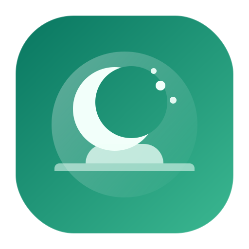
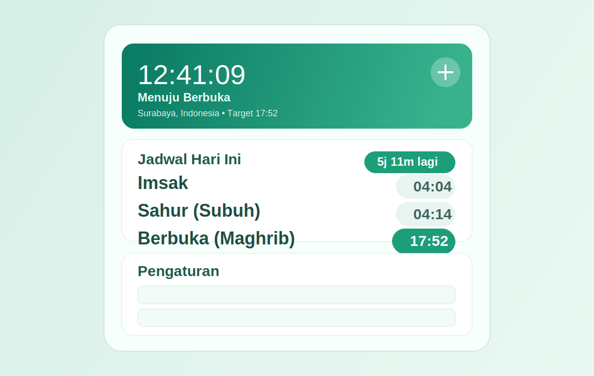

# PuasaMenuBar

<p align="center">
  
</p>

<p align="center">
  <b>A modern macOS menu bar app for daily fasting prayer schedule tracking.</b>
</p>

`PuasaMenuBar` menampilkan jadwal `Imsak`, `Subuh`, dan `Maghrib` langsung dari menu bar macOS, dengan UI hijau modern dan pengaturan lokasi/metode perhitungan.

## App Preview



## Highlights

- Menu bar app ringan (ikon-only).
- Jam realtime device (`HH:mm:ss`).
- Jadwal sholat harian via API AlAdhan (`timingsByCity`).
- Status puasa + countdown otomatis.
- Pengaturan `Kota`, `Negara`, dan `Metode` langsung dari UI.
- Pengaturan tersimpan otomatis (`UserDefaults`).
- Support build ke `.app` standalone (tidak bergantung terminal).
- Script autostart saat login macOS.

## Tech Stack

- Swift 6
- SwiftUI (macOS)
- AppKit (`MenuBarExtra` scene)
- Swift Package Manager

## Requirements

- macOS 13+
- Xcode Command Line Tools / Xcode terbaru
- Koneksi internet (untuk fetch jadwal API)

## Quick Start (Development)

```bash
cd /Users/admin/Desktop/PuasaMenuBar
swift run PuasaMenuBar
```

Catatan: jika dijalankan via `swift run`, app akan berhenti saat terminal ditutup.

## Build Standalone App (.app)

Gunakan script ini supaya app tetap jalan walau terminal ditutup:

```bash
cd /Users/admin/Desktop/PuasaMenuBar
./scripts/build_app_bundle.sh
open ./PuasaMenuBar.app
```

## Enable Auto Start at Login

Install LaunchAgent:

```bash
cd /Users/admin/Desktop/PuasaMenuBar
./scripts/install_autostart.sh
```

Disable Auto Start:

```bash
cd /Users/admin/Desktop/PuasaMenuBar
./scripts/uninstall_autostart.sh
```

## Project Structure

```text
PuasaMenuBar/
├── Package.swift
├── Sources/
│   └── PuasaMenuBar/
│       └── PuasaMenuBar.swift
└── scripts/
    ├── build_app_bundle.sh
    ├── install_autostart.sh
    └── uninstall_autostart.sh
```

## How It Works

1. App fetch jadwal harian berdasarkan `city`, `country`, dan `method`.
2. Timezone mengikuti metadata dari API.
3. Status puasa dihitung otomatis berdasarkan waktu sekarang vs jadwal hari ini.
4. UI update realtime setiap detik.

## Troubleshooting

- **Jadwal tidak muncul / error fetch**
  - Cek koneksi internet.
  - Pastikan nama kota/negara valid.
  - Klik `Refresh` di UI.

- **App hilang saat terminal ditutup**
  - Jalankan versi `.app` dari hasil script `build_app_bundle.sh`.

- **Autostart tidak aktif**
  - Jalankan ulang `./scripts/install_autostart.sh`.
  - Cek file: `~/Library/LaunchAgents/com.admin.PuasaMenuBar.autostart.plist`.

## Roadmap Ideas

- Notification sebelum imsak/maghrib.
- Adzan sound optional.
- Multi-theme switcher.
- Auto-detect location.

## Author

Built by [@sigit485](https://github.com/sigit485)
